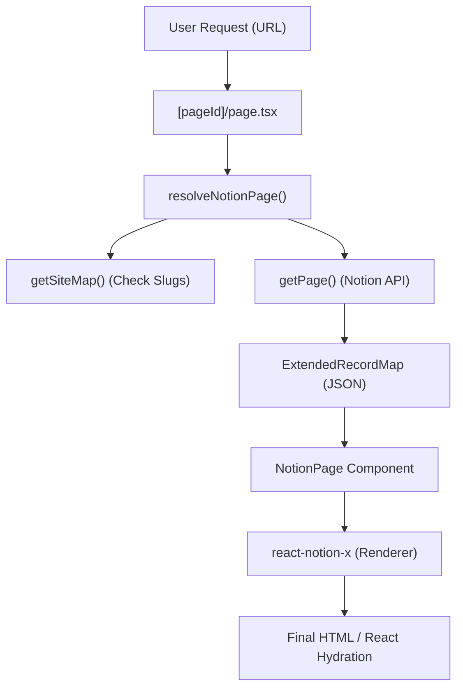

# System Architecture: Next.js Notion Starter

This document provides a technical overview of the system architecture, integration points, and data flow for the current implementation.

## Tech Stack

- **Framework**: [Next.js](https://nextjs.org/) (Version 16+)
- **Renderer**: [react-notion-x](https://github.com/NotionX/react-notion-x) - High-performance Notion page renderer.
- **CMS**: [Notion](https://www.notion.so/) - Used as a headless CMS via the Notion API.
- **API Client**: `notion-client` - Official-ish Notion API client used by `react-notion-x`.
- **Styling**: Vanilla CSS + Modular CSS.
- **PDF Rendering**: `react-pdf` with a custom proxy for Notion-hosted files.
- **Routing**: Next.js App Router for page rendering, plus legacy Pages Router API routes under `src/pages/api`.

## Core Components

### 1. Page Resolution (`src/lib/resolve-notion-page.ts`)
This is the entry point for every page request. It maps the incoming URL (either a Notion ID or a slug) to a specific Notion `pageId`. It uses `getSiteMap` to handle friendly URLs.

### 2. Notion Fetching (`src/lib/notion.ts` and `src/lib/notion-api.ts`)
The Notion integration is split across two layers:
- `src/lib/notion-api.ts` creates the shared `NotionAPI` client.
- `src/lib/notion.ts` adds application-specific behavior, including:
- **Retry Logic**: `withRetry` handles transient API failures.
- **Navigation Pre-fetching**: Fetches record maps for pages linked in the custom header to ensure smooth transitions.
- **Signed URL Handling**: Disables default signed URLs to prevent SSG breakage (handled via proxies instead).

### 3. Notion Renderer (`src/components/NotionPage.tsx`)
The main UI component that wraps `NotionRenderer` from `react-notion-x`. It configures:
- **Dynamic Imports**: Code highlighting, equations, and collections are loaded only when needed.
- **Custom PDF Strategy**: Overrides the default PDF block to use a custom proxy (`/api/notion-pdf`) to avoid CORS and expiration issues.
- **Image Error Handling**: A global listener hides broken images (common with expired Notion S3 links).
- **Page-level composition**: Attaches the custom header, footer, sidebar behavior, metadata, and dark mode handling around the rendered Notion content.

## Data Flow

```mermaid
graph TD
    User["User Request (URL)"] --> Route["[pageId]/page.tsx"]
    Route --> Resolve["resolveNotionPage()"]
    Resolve --> SiteMap["getSiteMap() (Check Slugs)"]
    Resolve --> Fetch["getPage() (Notion API)"]
    Fetch --> RecordMap["ExtendedRecordMap (JSON)"]
    RecordMap --> Renderer["NotionPage Component"]
    Renderer --> NotionX["react-notion-x (Renderer)"]
    NotionX --> HTML["Final HTML / React Hydration"]
```

## Special Features

### Image Proxying & LQIP
- Images are proxied through Notion's internal image service to avoid direct S3 link expiration.
- `preview-images.ts` contains preview image support scaffolding, but it is not enabled in the current fetch path by default.

### PDF Rendering
Notion's S3 links for PDFs expire. The system uses `/api/notion-pdf` to re-sign and fetch PDF content on demand, ensuring documents remain accessible.

### ISR (Incremental Static Regeneration)
The project uses `generateStaticParams` in `src/app/[pageId]/page.tsx` and `src/app/tags/[tagName]/page.tsx` to pre-generate known routes while allowing runtime regeneration with `revalidate = 60`.

### Metadata and platform routes
- `src/app/sitemap.ts` generates `sitemap.xml` from the Notion site map.
- `src/app/robots.ts` generates `robots.txt`.
- There are no feed routes in the current codebase.
