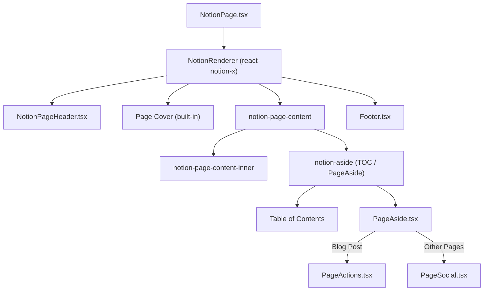

# UI Components & Styling Guide

This document covers the UI component architecture, CSS layering, and layout system used by the Next.js Notion Starter site.

## Component Hierarchy



## Layout System

### Width Architecture

All primary layout elements use **viewport-relative widths** (`65vw`) to maintain consistent proportions across resolutions and zoom levels:

| Element | Width | Defined In |
|---|---|---|
| Main content | `--notion-max-width: 65vw` | `notion.css` |
| Cover image | `max-width: 65vw` | `notion.css` |
| Nav header | `max-width: 65vw` | `notion.css` |
| Footer | `max-width: 65vw` | `styles.module.css` |
| Aside (TOC) | `calc(17.5vw - 2.5rem)` | `notion.css` |

### Aside Layout Formula (react-notion-x)

The library positions the aside using:

```css
.notion-page-content-has-aside {
    width: calc((100vw + var(--notion-max-width)) / 2);
}
```

With `65vw` content, this computes to `82.5vw`. The article takes `65vw`, leaving `17.5vw` for the aside. The container is left-aligned to the content's left edge, so it extends to the right viewport edge.

### Responsive Breakpoints

| Breakpoint | Behavior |
|---|---|
| `≥ 1000px` | Aside visible (side-by-side layout) |
| `< 1000px` | Library hides aside |
| `< 900px` | Aside force-hidden via override |
| `< 720px` | Page padding switches to `2vw` |
| `< 600px` | Search button hidden |

## CSS Layering

### Layer 1: react-notion-x (`node_modules/react-notion-x/src/styles.css`)
Base Notion-like styling. Key variables:
- `--notion-max-width`: Controls content width
- `--notion-header-height`: Controls header height
- `.notion-aside`: `position: sticky`, `display: none` by default, shown via `@media (min-width: 1300px)` (overridden to `1000px`)

### Layer 2: Site overrides (`src/styles/notion.css`)
Site-specific adjustments to react-notion-x defaults:
- Width system (`65vw` viewport-relative)
- Cover image styling (rounded corners, shadow)
- TOC typography (12px, left-aligned, word-wrapped)
- Header/footer width synchronization
- `overflow-x: clip` on `.notion-page-scroller` (prevents horizontal scrollbar while preserving `position: sticky`)

### Layer 3: Component styles (`src/components/styles.module.css`)
CSS Modules for component-specific styling:
- Footer layout (flex row, responsive column on mobile)
- Page actions (tweet, retweet buttons)
- Dark mode toggle
- Loading spinner

### Layer 4: Page social (`src/components/PageSocial.module.css`)
Isolated styles for social icon buttons (circular, hover animations).

## Key Components

### NotionPage.tsx
Main page renderer. Configures `NotionRenderer` with dynamic imports for Code, Collection, Equation, PDF, and Modal components. Determines if a page is a blog post (child of a collection) to decide whether to show the Table of Contents.

### PageAside.tsx
Conditional aside content:
- **Blog posts**: Shows `PageActions` (tweet/retweet links)
- **Other pages**: Shows `PageSocial` (social icon buttons)

### NotionPageHeader.tsx
Custom navigation header with:
- Breadcrumbs (root page link)
- Navigation links (configured in `site.config.ts`)
- Dark mode toggle
- Search button

### Footer.tsx
Site footer with copyright, dark mode toggle, and social links (Twitter, GitHub, LinkedIn, Newsletter, YouTube).

## Critical CSS Gotchas

1. **`overflow-x: clip` vs `hidden`**: Using `hidden` on `.notion-page-scroller` breaks `position: sticky` on the aside. Use `clip` instead.
2. **`min-width: 222px`**: The library forces this on `.notion-aside-table-of-contents`. Must override to `0` for responsive behavior.
3. **Cover width sync**: The cover uses a separate `max-width` rule — it must be manually kept in sync with `--notion-max-width`.
