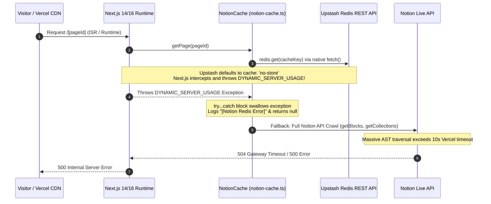

# Vercel Caching & ISR Architecture: Resolving Fluid Compute & Memory Bottlenecks

This document provides a highly thorough, comprehensive architectural breakdown of the caching, Incremental Static Regeneration (ISR), and build-time optimization journey for the Next.js Notion Starter. It details the exact root causes, intermediate pitfalls, and final architectural decisions made to resolve severe Vercel Fluid Compute timeouts, memory capacity limits, and runtime 500 errors.

---

## 1. The Initial Problem: Vercel Fluid Compute & Memory Capacity Issues

As the Notion workspace grew to hundreds of articles and collections, deployments on Vercel began experiencing severe performance degradation, resulting in frequent 500/504 Serverless Function Timeouts and exceeding the allocated `1 vCPU / 2 GB Memory` limits.

### Symptoms
- **Dynamic Server Usage Errors in Production:** Serverless functions failed with `500 Internal Server Error` during runtime page navigations (e.g., `/wiki`, `/blogs`, and collection pages).
- **High Fluid Compute Bills & Long Execution Times:** Vercel functions remained active for the maximum 10-second serverless execution duration before crashing.
- **Memory Exhaustion:** Parsing massive, deeply nested Notion ASTs (Abstract Syntax Trees) and linked database views repeatedly in memory caused frequent Out-Of-Memory (OOM) crashes.

---

## 2. The Root Cause Investigation: The `DYNAMIC_SERVER_USAGE` Trap

The investigation revealed a multi-layered architectural flaw involving Next.js 14/16 App Router caching mechanics, `@upstash/redis`, and fallback Notion API crawls.

### Step-by-Step Breakdown of the Failure Loop



### 1. The `@upstash/redis` `no-store` Default
By default, the `@upstash/redis` SDK utilizes the native Node.js `fetch()` API to communicate with Upstash REST endpoints. Crucially, the SDK configures these fetch requests with `cache: 'no-store'` to ensure it always retrieves the latest key value.

### 2. Next.js 14/16 Static & ISR Interception
When Next.js renders a page statically or executes an ISR background revalidation function, it strictly monitors all outgoing `fetch()` calls. If Next.js encounters a `fetch()` configured with `cache: 'no-store'` inside a static/ISR context, it immediately aborts the static pass by throwing an internal control-flow exception named `DYNAMIC_SERVER_USAGE`.

### 3. Swallowing the Exception in `notion-cache.ts`
Inside `NotionCache.getPage()`, the `redis.get()` call was wrapped in a defensive `try...catch` block. When Next.js threw `DYNAMIC_SERVER_USAGE`, the `catch` block intercepted it, treated it as a standard Redis connection failure, logged `[Notion Redis Error] GET page:... Error: Dynamic server usage`, and returned `null`.

### 4. The Fatal Fallback Crawl
Because `redis.get()` returned `null`, the application assumed the cache was empty. It immediately initiated a full, unoptimized Notion API crawl (`getCollectionData` -> `getPage` -> `getBlocks`). Crawling large databases with dozens of linked views requires multiple sequential HTTP round-trips to Notion's API. This massive operation consistently breached Vercel's 10-second serverless execution window, causing the function to crash with a 500 error.

---

## 3. The Definitive Architectural Solution

To achieve complete stability, eliminate 500 errors, and ensure lightning-fast static delivery, we implemented a three-pillar caching and build orchestration architecture.

### Pillar 1: Overriding Upstash Cache Mode at the Constructor Level

To prevent Next.js from throwing `DYNAMIC_SERVER_USAGE`, we explicitly configured the `@upstash/redis` client constructor with `cache: 'default'`.

```typescript
// src/lib/notion-cache.ts
this.redis = (process.env.UPSTASH_REDIS_REST_URL || process.env.KV_REST_API_URL)
  ? new Redis({
      url: process.env.UPSTASH_REDIS_REST_URL || process.env.KV_REST_API_URL!,
      token: process.env.UPSTASH_REDIS_REST_TOKEN || process.env.KV_REST_API_TOKEN!,
      cache: 'default' // Matches RequesterConfig TypeScript definition perfectly
    })
  : null;
```

**Architectural Impact:** By passing `cache: 'default'`, Upstash's underlying fetch calls no longer trigger Next.js dynamic bailouts. `redis.get()` executes instantly in milliseconds during both SSG and ISR runtime contexts.

### Pillar 2: Hybrid Build-Time Cache Warming & Worker Synchronization

During the Vercel deployment build phase (`next build`), Next.js spawns multiple parallel worker threads (`Generating static pages using 2 workers...`). If each worker attempted to hit the Notion API independently, Vercel would get severely rate-limited (HTTP 429) by Notion.

We designed a synchronized warmup pipeline:

1. **Build Phase Marker:** `next.config.js` creates a `.build-phase` marker file synchronously before compilation begins. `NotionCache` detects this file to know it is running inside a build environment.
2. **Sequential Warmup (`build-warmup`):** Before worker threads spawn, the main build process warms the cache. It fetches all sitemaps, navigation links, and 300+ Notion pages directly from Upstash Redis (or Notion API on cache miss) and writes them to the local Vercel build container filesystem (`.notion-cache/`).
3. **100% Worker Filesystem Hits:** When Next.js spawns parallel workers to render static HTML, every single page lookup hits the pre-warmed local disk cache (`[Notion FS HIT]`). Zero network calls are made to Notion or Redis during the worker phase, resulting in flawless builds completed in ~20 seconds.

### Pillar 3: Restoring Live ISR Revalidation Mechanics

With Redis communication fully stabilized, we restored the runtime `effectiveTTL` back to `revalidateTTL` (1 hour) for `getPage`, `getNavLinkPage`, and `getSitemap`.

```typescript
// Inside notion-cache.ts
const effectiveTTL = (source === 'build-warmup' || this.isBuildPhase) 
  ? redisPageTTL // 7 days during build warmup to ensure build stability
  : revalidateTTL; // 1 hour at runtime for ISR background updates
```

**How ISR Operates in Production:**
1. A visitor requests `/wiki` after 1 hour. Vercel serves the stale CDN edge cache instantly and spawns a background ISR revalidation function.
2. `notionCache.getPage` calls `redis.get()`. Thanks to `cache: 'default'`, no exception is thrown.
3. `notionCache` evaluates the timestamp: `if (now - cached.timestamp < revalidateTTL * 1000)`. Since 1 hour has elapsed, it identifies the cache as stale (`[Notion Redis STALE]`) and returns `null`.
4. The background function executes a clean, targeted fetch against the Notion API, retrieves the latest live content edits, updates Upstash Redis (`redis.set`), and returns the fresh AST.
5. Vercel updates its global CDN edge cache seamlessly.

---

## 4. Key Learnings & Summary of Best Practices

1. **Never Wrap `fetch` Blindly in `try...catch` in Next.js:** Next.js uses internal exceptions (`DYNAMIC_SERVER_USAGE`, `NEXT_REDIRECT`, `NEXT_NOT_FOUND`) for control flow. Catching and swallowing these errors in utility libraries will cause catastrophic rendering fallbacks.
2. **Align SDK Configurations with Next.js App Router Rules:** Always verify the `cache` header policy of third-party REST SDKs (like Upstash, Supabase, or Algolia) when running inside Next.js 14/16 Server Components.
3. **Separate Build-Time TTL from Runtime TTL:** Using a long TTL (e.g., 7 days) during build warmup guarantees build success and prevents API rate limits, while using a shorter TTL (e.g., 1 hour) at runtime preserves dynamic ISR content freshness.
